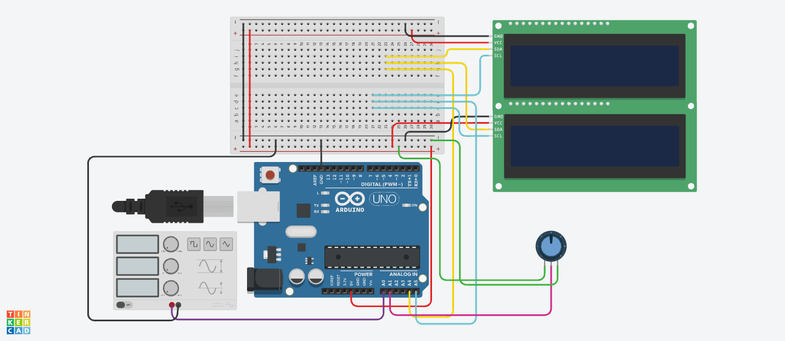

# Arduino Oscilloscope with a 16x4 Character LCD Display

A simple oscilloscope built in **Tinkercad Circuits** using an Arduino Uno and **two 16x2 I2C LCDs stacked into one 16x4 screen**. It samples a voltage on A0 and draws the waveform on the LCDs using custom characters. A potentiometer works as a time/div knob.

🔗 **Tinkercad simulation:** [open the circuit](PASTE_YOUR_TINKERCAD_LINK_HERE)



---

## Features

- Live waveform display on a 16 x 32 dot grid (16 columns, 32 height levels)
- Two I2C LCDs combined into one 16x4 screen on a single I2C bus
- Potentiometer controls the sampling speed (like the time/div knob on a real oscilloscope)
- Values also sent to the Serial Monitor, which can graph them
- Only redraws the cells that change, to keep the display fast

---

## How it works

### Drawing a graph on a text display

A 16x2 LCD shows characters, not pixels. Each character cell is a 5 x 8 dot grid, and each LCD can store **8 custom characters**. The code creates 8 characters, each a flat line at one of the 8 heights inside a cell:

```
level 7: █████   (top dot-row)
   ...
level 0: █████   (bottom dot-row)
```

Stacking two LCDs gives 4 text rows x 8 dot-rows = **32 height levels**. Each of the 16 columns shows one sample.

### Mapping a sample to the screen

1. The Arduino reads A0 (0 to 1023) and maps it to a height `y` from 0 to 31.
2. `y / 8` gives the text row (counted from the bottom), so `screenRow = 3 - (y / 8)`.
3. `y % 8` gives the height inside that cell, which is the custom character to draw.
4. Rows 0-1 are on the top LCD and rows 2-3 are on the bottom LCD.

### Timing

The loop captures 16 samples, with a delay between samples set by the potentiometer (5 to 100 ms), and then draws them. A longer delay shows more of the wave across the screen.

---

## Design files

| File | What it is |
|---|---|
| [Schematic (PDF)](Oscilloscope.pdf) | Circuit schematic exported from Tinkercad |
| [PCB board file (.brd)](Oscilloscope.brd) | Board file exported from Tinkercad, opens in Autodesk Fusion or KiCad (import) |
| [`oscilloscope.ino`](oscilloscope.ino) | Arduino code |

---

## Parts

| Part | Quantity |
|---|---|
| Arduino Uno R3 | 1 |
| LCD 16x2 with I2C backpack | 2 |
| Function generator (signal source) | 1 |
| Potentiometer (10 kΩ) | 1 |
| Breadboard | 1 |

---

## Wiring

**Both LCDs** (sharing the same I2C bus):

| LCD pin | Arduino |
|---|---|
| GND | GND |
| VCC | 5V |
| SDA | A4 |
| SCL | A5 |

The two LCDs must have **different I2C addresses**: top LCD `0x20`, bottom LCD `0x21`.

**Signal input:**

| Function generator | Arduino |
|---|---|
| + | A0 |
| – | GND |

**Time/div potentiometer:**

| Potentiometer pin | Arduino |
|---|---|
| Left terminal | 5V |
| Wiper (middle) | A1 |
| Right terminal | GND |

**Function generator settings:** 1 Hz, amplitude 2 V, DC offset 2.5 V, so the signal stays within the Arduino's 0-5 V input range.

---

## Running it

1. Open the Tinkercad link above, or build the circuit using the wiring tables.
2. Paste [`oscilloscope.ino`](oscilloscope.ino) into the Code panel (Text mode).
3. Start the simulation. Both LCDs show a startup message, then the waveform appears.
4. Turn the potentiometer to stretch or squeeze the wave. Try sine, square, and triangle shapes.

The code uses the `Adafruit_LiquidCrystal` library, which is built into Tinkercad.

---

## Limitations

| | This project | A lab oscilloscope |
|---|---|---|
| Sample rate | a few hundred samples/s | millions to billions of samples/s |
| Input range | 0 to 5 V only | negative and positive voltages, hundreds of volts with probes |
| Resolution | 16 x 32 dots | hundreds of pixels |
| Best for | slow signals (sensors, low-frequency waves) | almost anything |

- **Aliasing:** if a signal is faster than about half the sample rate, the display shows a false, slower wave.
- **Gaps:** there are small gaps between character cells and between the two LCDs, so the waveform has visible breaks.
- **No negative voltages:** the Arduino's ADC reads only 0-5 V. Negative signals would need a level-shifting circuit.

---

## Things I learned

- How to build graphics on a character LCD with custom characters, and how the 8-character limit shapes the design
- How multiple devices share one I2C bus using different addresses
- Arduino automatically adds function declarations above `#include` lines, so a function that takes a library type (like `Adafruit_LiquidCrystal&`) as a parameter fails to compile with "not declared in this scope" errors
- How sample rate limits what a digital oscilloscope can display

---

## Future improvements

- Connect neighboring samples with vertical lines so square waves look continuous
- Show frequency and peak voltage on the screen
- Add a trigger so the waveform stays still instead of drifting
- Add a level-shifting input stage to measure negative voltages

---

## License

MIT
